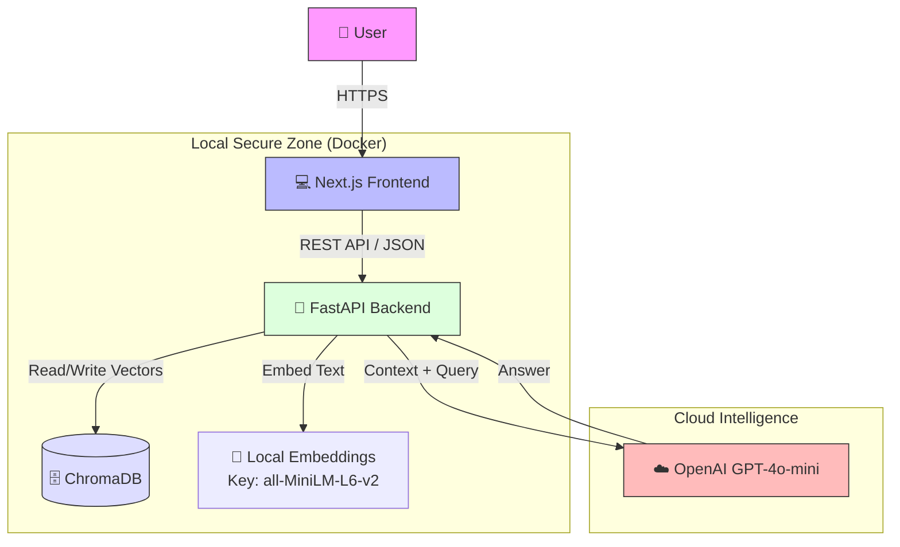

# 🏗️ High-Level Design (HLD) - DocMind AI

## 1. System Overview

DocMind AI is a **Hybrid RAG (Retrieval-Augmented Generation)** platform. It enables secure, private interaction with enterprise documents by keeping the "Knowledge Base" local while leveraging cloud-based "Reasoning Engines" (LLMs) for answer synthesis.

## 2. Architecture Diagram

## 3. Key Components

### A. Frontend (Client Layer)
- **Tech**: Next.js 14, TailwindCSS, Framer Motion.
- **Responsibility**: 
  - Handles user chat input.
  - PDF File Uploads.
  - Visualizing "Thinking" state.
  - displaying specific "Sources/Citations" returned by the API.

### B. Backend (Orchestration Layer)
- **Tech**: Python 3.10, FastAPI, LangChain.
- **Responsibility**:
  - **Ingestion**: Accepts PDFs, sanitizes text, chunks into segments (1000 chars).
  - **Vectorization**: Uses `HuggingFaceSettings` to convert text → vectors locally.
  - **Retrieval**: Performs Cosine Similarity search in ChromaDB.
  - **Synthesis**: Constructs a prompt with the retrieved context and sends to OpenAI.

### C. Data Layer (Persistence)
- **Tech**: ChromaDB (Vector Store).
- **Storage**: Docker Volume (`./chroma_data`).
- **Data Encapsulation**: Document embeddings are stored as dense vectors (384 dimensions).

### D. Intelligence Layer (Inference)
- **Tech**: OpenAI API (`gpt-4o-mini`).
- **Role**: Pure reasoning. It does *not* store the data. It merely processes the context provided in the prompt window.

## 4. Design Decisions & Trade-offs

| Decision | Option Selected | Alternative | Rationale |
| :--- | :--- | :--- | :--- |
| **Embedding Model** | **Local (HuggingFace)** | OpenAI Embeddings | **Privacy & Cost**. Local embeddings mean the raw text of the entire document never leaves the server during ingestion. |
| **Vector DB** | **ChromaDB (Local)** | Pinecone (Cloud) | **Data Sovereignty**. Clients need assurance that indices are not on multi-tenant cloud infrastructure. |
| **Frontend** | **Next.js** | React (CRA) | **SSR & Performance**. Better SEO potential and faster initial load for the dashboard. |

## 5. Security & Privacy
1. **Data Minimization**: Only the specific paragraphs relevant to a question are sent to the Cloud LLM. The full document remains local.
2. **Ephemeral Processing**: The Cloud LLM (if configured correctly via Enterprise agreements) does not retain data sent via API for training.

