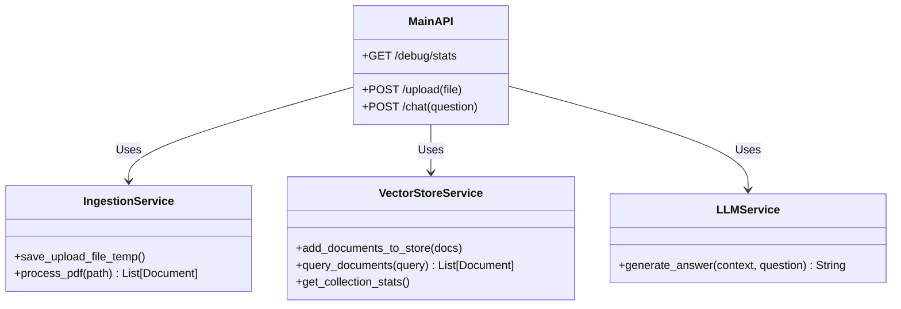

# ⚙️ Low-Level Design (LLD) - DocMind AI

## 1. Backend Service Design (`/backend`)

The backend is structured as a modular FastAPI application using the **Service-Repository** pattern (simplified for this MVP).

### 1.1 Class/Module Diagram



### 1.2 Key Functions

#### `services.ingestion.process_pdf(file_path)`
- **Input**: Path to temporary PDF file.
- **Logic**:
  1. Uses `PyPDFLoader` to extract raw text.
  2. Uses `RecursiveCharacterTextSplitter`:
     - `chunk_size`: 1000 characters.
     - `chunk_overlap`: 200 characters (preserves semantic context across boundaries).
- **Output**: List of LangChain `Document` objects.

#### `services.vector_store.query_documents(query)`
- **Input**: User string question.
- **Logic**:
  1. Embeds the query using `all-MiniLM-L6-v2` (Local CPU).
  2. Performs K-Nearest Neighbors (KNN = 3) search in ChromaDB.
- **Output**: Top 3 matching `Document` chunks.

#### `services.llm.generate_answer(context, question)`
- **Input**: Combined text from top 3 chunks + User Question.
- **Prompt Template**:
  ```text
  You are DocMind AI...
  Context: {context}
  Question: {question}
  ```
- **Output**: String response from GPT-4o-mini.

## 2. Frontend Component Design (`/frontend`)

The frontend is a single-page application (SPA) built with Next.js App Router.

### 2.1 Component Structure

- **`page.tsx`**: Main entry point. Wraps `ChatInterface`.
- **`ChatInterface.tsx`**:
  - **State**:
    - `messages`: Array of chat history.
    - `isUploading`: Boolean loading state.
    - `showDebug`: Boolean to toggle Neural Inspector.
  - **Logic**:
    - Handles file selection -> `POST /api/upload`.
    - Handles text submission -> `POST /api/chat`.
- **`NeuralInspector.tsx`**:
  - Fetches data from `GET /api/debug/stats`.
  - Renders a grid of "Vector Cards" to show what the database currently holds.

### 2.2 API Integration
All API calls interact with `http://localhost:8000`.
- **CORS**: Enabled on Backend to allow requests from `localhost:3000`.

## 3. Data Schema

### ChromaDB Collection: `docmind_collection`
| Field | Type | Description |
| :--- | :--- | :--- |
| **id** | UUID | Unique Chunk ID |
| **embedding** | Vector[384] | Floats representing semantic meaning |
| **document** | String | The actual text content of the chunk |
| **metadata** | JSON | `{"source": "filename.pdf", "page": 1}` |

