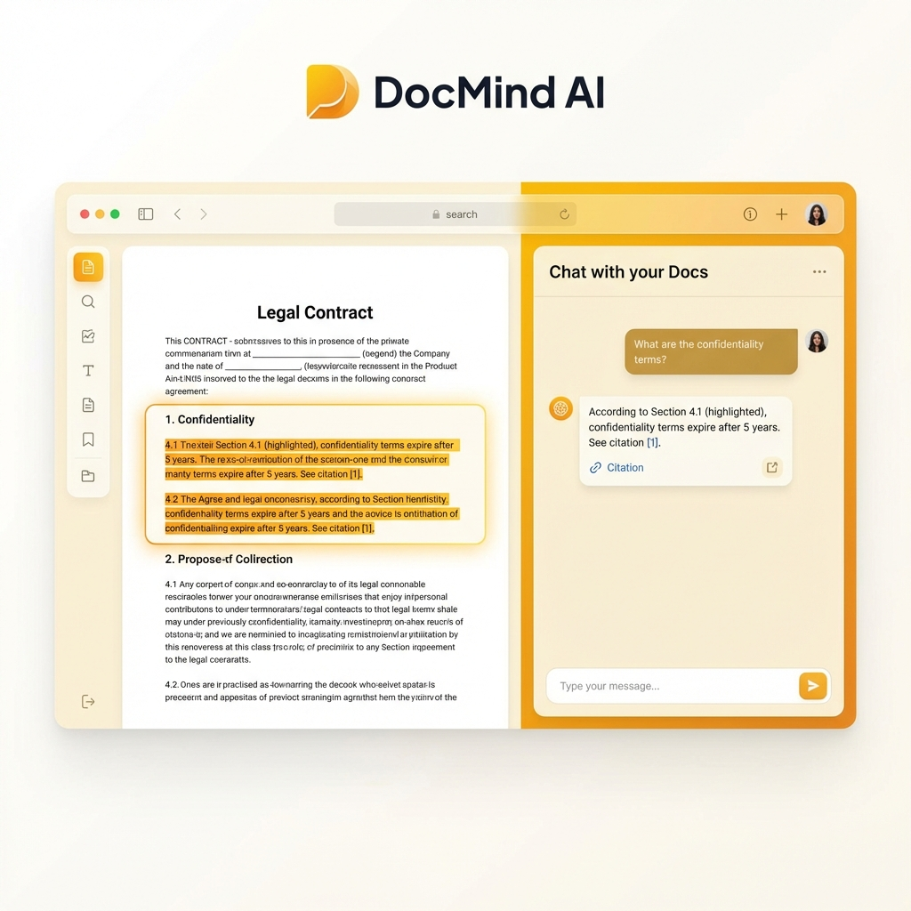
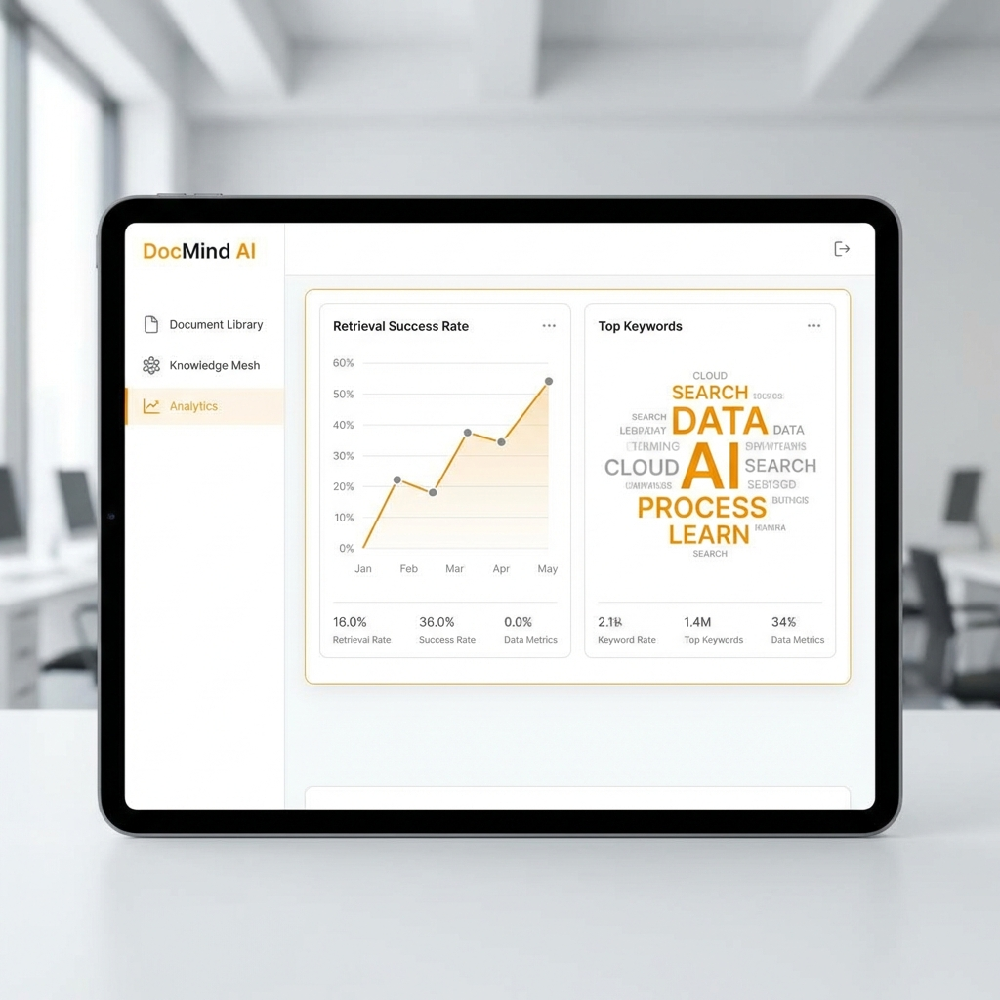
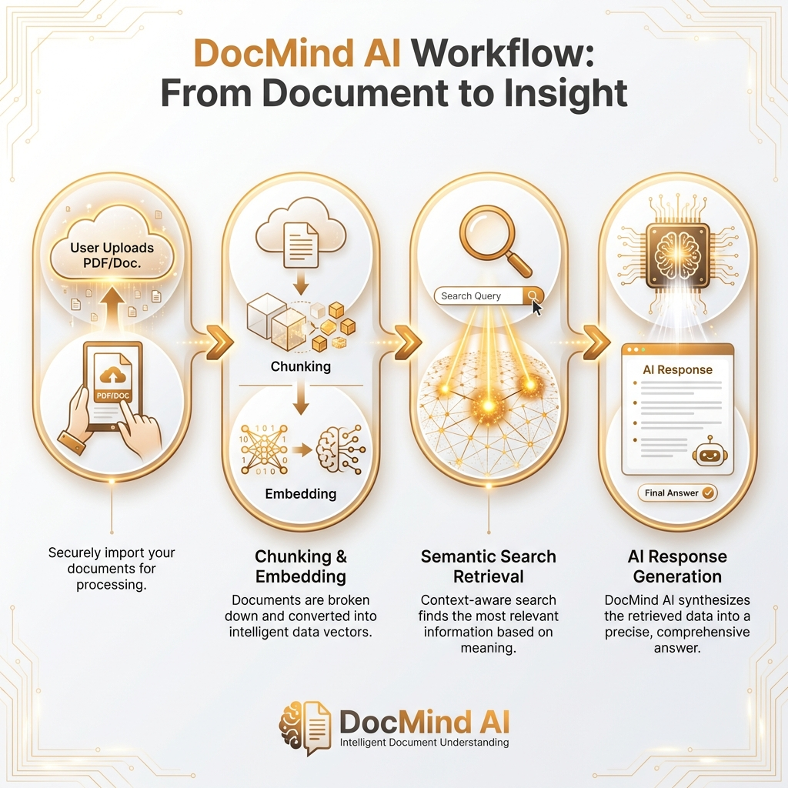
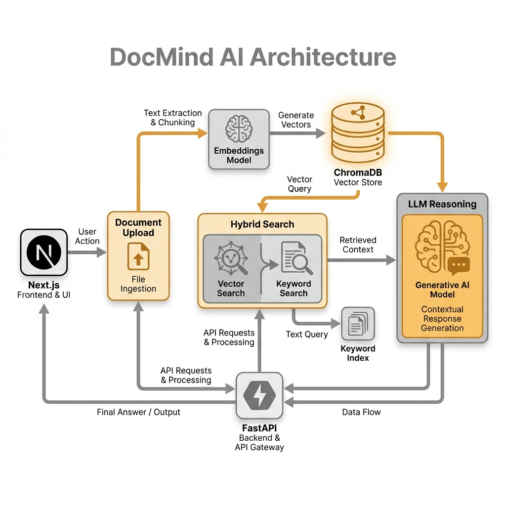

# DocMind AI

> **Hybrid RAG Engine**: Seamlessly toggling between Cloud (OpenAI) and Local (Ollama) inference for enterprise-grade document intelligence.

<div align="center">


</div>

---

## 🖼️ Visual Gallery (V3 Standard)

|  |  |
|:---:|:---:|
| **Smart Document Chat** | **Retrieval Analytics** |

|  |  |
|:---:|:---:|
| **RAG Hybrid Pipeline** | **Distributed Knowledge System** |

---

## 🚀 Quick Start

Launch the platform:

```bash
# 1. Start Backend (API + Vector DB)
docker-compose up -d --build

# 2. Start Frontend (UI)
cd frontend && npm install && npm run dev
```

> **Detailed Setup**: See [GETTING_STARTED.md](./docs/GETTING_STARTED.md).

---

## ✨ Key Features

*   **🧠 Hybrid Brain**: Switch between **GPT-4o** (Cloud) and **Llama 3** (Local) instantly.
*   **📚 RAG Pipeline**: Production-grade Recursive Character Splitting (1000/200).
*   **🔍 Neural Inspector**: Visual debugging tool to see what's inside your Vector DB.
*   **🔒 Privacy First**: Fully local vector storage using self-hosted **ChromaDB**.

---

## 🎯 Senior Engineer Signals (Self-Audit)

*   **Hybrid Inference**: Implementation of an abstraction layer to swap between OpenAI and Local LLMs without code changes.
*   **Search Optimization**: Hybrid Search strategy combining Vector embeddings and Keyword indexing for high precision.
*   **Data Sovereignty**: Local-first architecture ensuring sensitive documents never leave the client infrastructure.
*   **Observability**: Integrated analytics to monitor retrieval accuracy and latency across different LLM backends.

---

## 📚 Documentation

| Document | Description |
| :--- | :--- |
| [**System Architecture**](./docs/ARCHITECTURE.md) | Chunking, Embeddings, and HLD. |
| [**Getting Started**](./docs/GETTING_STARTED.md) | Setup guide for Cloud vs Local mode. |
| [**Failure Scenarios**](./docs/FAILURE_SCENARIOS.md) | Handling "Hallucinations" and Rate Limits. |
| [**Interview Q&A**](./docs/INTERVIEW_QA.md) | "What is RAG?" and "Why Vector DBs?". |

---

## 👤 Author

**Harshan Aiyappa**  
Senior Full-Stack Hybrid Engineer  
[Portfolio](https://kimo-nexus.vercel.app/) • [GitHub Profile](https://github.com/Kimosabey)
