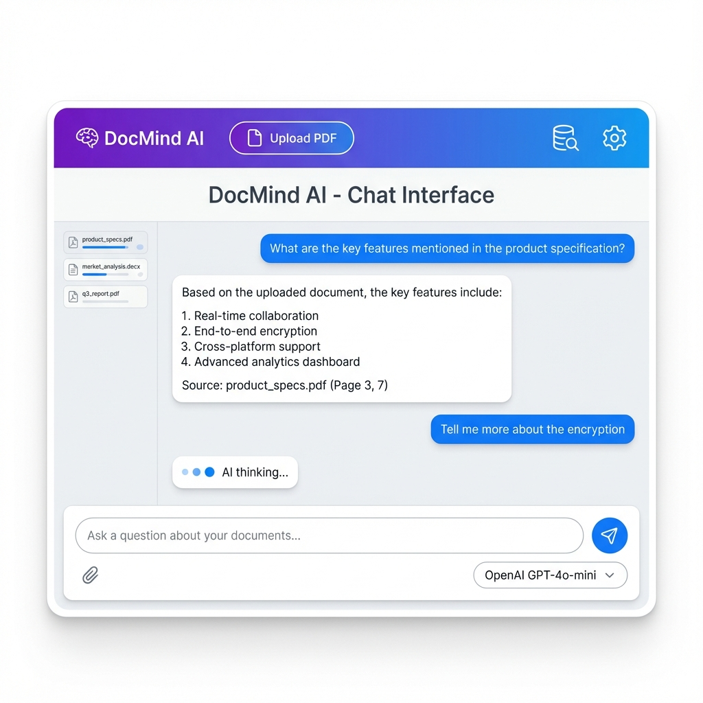
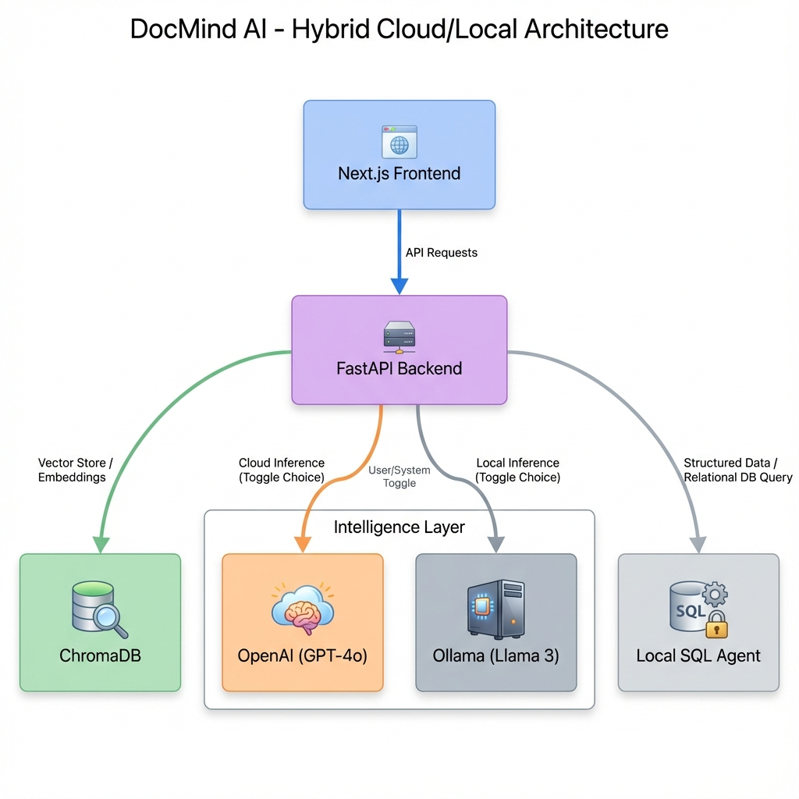

# DocMind AI



## Enterprise RAG System with Hybrid Inference

<div align="center">


</div>

**DocMind AI** is a privacy-first Document Intelligence platform. It employs **Retrieval-Augmented Generation (RAG)** to allow users to "chat" with their PDF documents. Unlike simple wrappers, DocMind features a **Hybrid Architecture** that toggles seamlessly between Cloud (OpenAI) and Local (Llama 3) inference, ensuring data sovereignty when needed.

---

## 🚀 Quick Start

Launch the platform:

```bash
# 1. Start Backend (API + Vector DB)
docker-compose up -d --build

# 2. Start Frontend (UI)
cd frontend && npm install && npm run dev
```

> **Detailed Setup**: See [GETTING_STARTED.md](./docs/GETTING_STARTED.md).

---

## 📸 Demo & Architecture

### RAG Pipeline Flow

*Ingestion -> Chunking -> Embedding -> Vector Store -> Generation*

### Hybrid System Architecture

*FastAPI Bridge toggling between OpenAI and Local Llama 3*

### Neural Inspector

*Real-time observability into the contents of the Vector Database*

> **Deep Dive**: See [ARCHITECTURE.md](./docs/ARCHITECTURE.md) for chunking strategies.

---

## ✨ Key Features

*   **🧠 Hybrid Brain**: Switch between **GPT-4o** (Cloud) and **Llama 3** (Local) instantly.
*   **📚 RAG Pipeline**: Production-grade Recursive Character Splitting (1000/200).
*   **🔍 Neural Inspector**: Visual debugging tool to see what's inside your Vector DB.
*   **🔒 Privacy First**: Fully local vector storage using self-hosted **ChromaDB**.

---

## 📚 Documentation

| Document | Description |
| :--- | :--- |
| [**System Architecture**](./docs/ARCHITECTURE.md) | Chunking, Embeddings, and HLD. |
| [**Getting Started**](./docs/GETTING_STARTED.md) | Setup guide for Cloud vs Local mode. |
| [**Failure Scenarios**](./docs/FAILURE_SCENARIOS.md) | Handling "Hallucinations" and Rate Limits. |
| [**Interview Q&A**](./docs/INTERVIEW_QA.md) | "What is RAG?" and "Why Vector DBs?". |

---

## 🔧 Tech Stack

| Component | Technology | Role |
| :--- | :--- | :--- |
| **Brain** | **FastAPI (Python)** | LangChain Orchestrator. |
| **Memory** | **ChromaDB** | Vector Store. |
| **Intelligence** | **OpenAI / Ollama** | LLM Providers. |
| **Interface** | **Next.js 14** | React UI. |

---

## 👤 Author

**Harshan Aiyappa**  
Senior Full-Stack Hybrid Engineer  
[GitHub Profile](https://github.com/Kimosabey)

---

## 📝 License

This project is licensed under the MIT License - see the [LICENSE](LICENSE) file for details.
