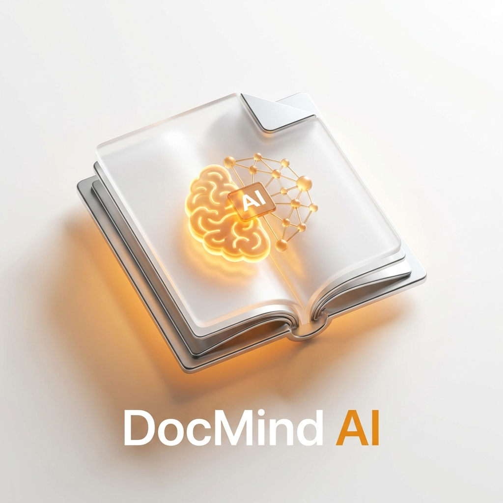

# DocMind AI - Hybrid RAG Intelligence System



## Enterprise-Grade Document Intelligence Platform

<div align="center">


</div>

**DocMind AI** is a privacy-first **Retrieval-Augmented Generation (RAG)** system designed to bridge the gap between secure local intelligence and high-performance cloud LLMs. It allows users to chat with massive PDF datasets using a **Hybrid Inference Bridge** that preserves data sovereignty while providing citation-backed accuracy.

---

## 🚀 Quick Start

Launch the platform in 2 steps:

```bash
# 1. Start Backend (API + Vector DB)
docker-compose up -d --build

# 2. Start Frontend Dashboard
cd frontend && npm install && npm run dev
```

> **Detailed Setup**: See [GETTING_STARTED.md](./docs/GETTING_STARTED.md).

---

## 📸 Demo & Architecture

### Smart Document Interface

*High-fidelity chat UI with real-time neural indexing telemetry.*

### System Architecture

*Hybrid Inference Gateway routing between OpenAI (Cloud) and Ollama (Local).*

### Neural Inspector

*Deep observability into the vector store and semantic document chunks.*

> **Deep Dive**: See [ARCHITECTURE.md](./docs/ARCHITECTURE.md) for Chunking Logic and Decision Logs.

---

## ✨ Key Features

*   **🧠 Hybrid Brain**: Switch between **GPT-4o** and **Llama 3** instantly.
*   **📚 RAG Pipeline**: Professional recursive splitting (1000/200 overlap).
    
*   **🔍 High-Precision Search**: Hybrid semantic + metadata filtering.
*   **🔒 Air-Gapped Ready**: Fully local vector storage using **ChromaDB**.

---

## 🏗️ The Intelligence Journey

Understanding how a PDF becomes a conversational agent:


1.  **Ingest**: Document parsed and cleaned via `pypdf`.
2.  **Chunk**: Segmented into 1000-char overlapping blocks.
3.  **Embed**: Converted to high-dimensional vectors.
4.  **Index**: Stored in ChromaDB with page-level metadata.
5.  **Query**: System retrieves top chunks to ground LLM responses.

---

## 📚 Documentation

| Document | Description |
| :--- | :--- |
| [**System Architecture**](./docs/ARCHITECTURE.md) | Vectors, Chunking, and Provider Abstraction. |
| [**Getting Started**](./docs/GETTING_STARTED.md) | Enviroment setup (Cloud vs Local mode). |
| [**Failure Scenarios**](./docs/FAILURE_SCENARIOS.md) | Hallucination mitigation and grounding logic. |
| [**Interview Q&A**](./docs/INTERVIEW_QA.md) | RAG strategy and technical justifications. |

---

## 🔧 Tech Stack

| Component | Technology | Role |
| :--- | :--- | :--- |
| **Brain** | **FastAPI (Python)** | LangChain Orchestrator. |
| **Memory** | **ChromaDB** | Local Vector Store. |
| **Intelligence** | **OpenAI / Ollama** | LLM Inference Backends. |
| **Interface** | **Next.js 14** | Enterprise Dashboard. |

---

## 👤 Author

**Harshan Aiyappa**  
Senior Full-Stack Hybrid Engineer  
[GitHub Profile](https://github.com/Kimosabey)

---

## 📝 License

This project is licensed under the MIT License - see the [LICENSE](LICENSE) file for details.
