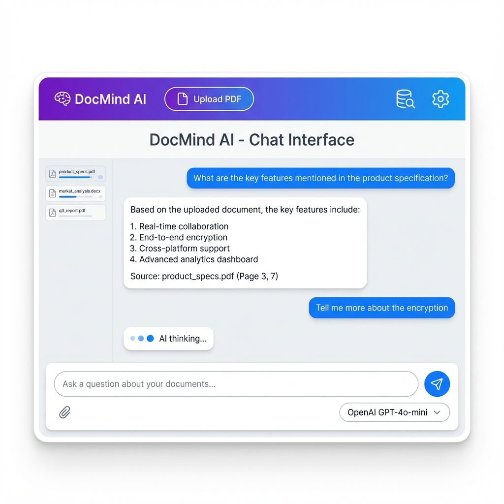
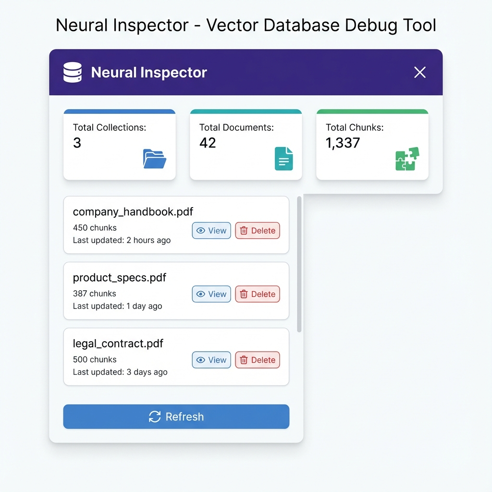
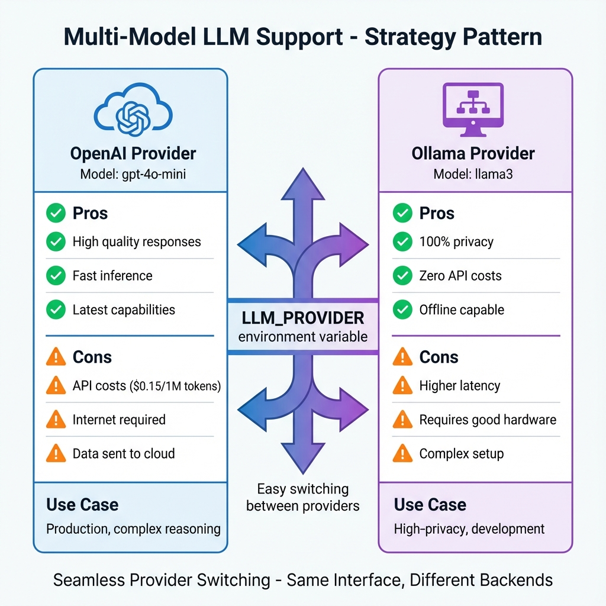
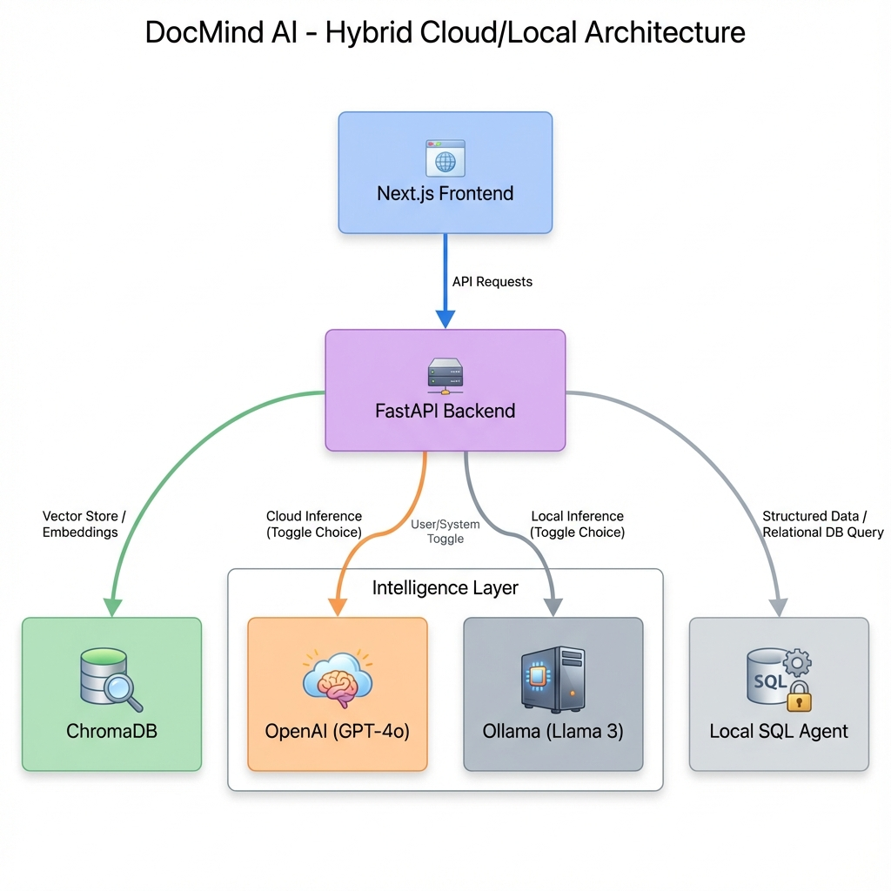
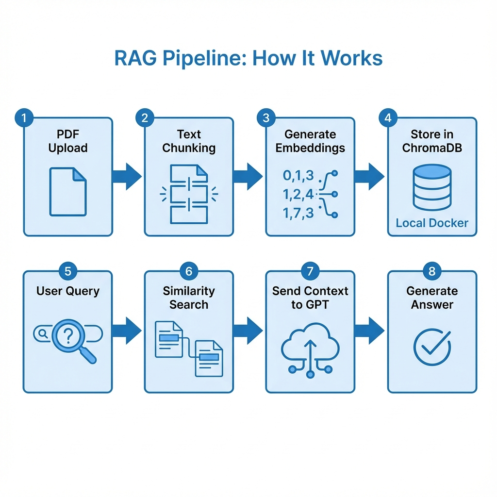

# 🧠 DocMind AI - Enterprise RAG System

> **Privacy-First Document Intelligence** | Hybrid Cloud-Local Architecture | Production-Grade RAG



<div align="center">


**Tech Stack**


</div>

---

## 🚀 Quick Start

### 1. Prerequisites
- **Docker** & **Docker Compose**
- **OpenAI API Key** (from [platform.openai.com](https://platform.openai.com))

### 2. Installation
```bash
# Clone the repository
git clone https://github.com/Kimosabey/docmind-ai.git
cd docmind-ai

# Configure Environment
cp .env.example .env
# Edit .env and set OPENAI_API_KEY=sk-your-actual-key-here
```

### 3. Start Services
```bash
# Start Backend Services (API + ChromaDB)
docker-compose up -d --build

# Start Frontend
cd frontend
npm install
npm run dev
```

### 4. Access Application
👉 **[http://localhost:3000](http://localhost:3000)**

---

## 📸 Screenshots

### Neural Inspector (Monitoring)

*Real-time vector storage and system metrics visualization*

### Multi-Model Architecture

*Hybrid cloud-local inference pipeline*

---

## ✨ Key Features

### 🚀 Core Capabilities
- **Multi-Model Support**: Toggle between GPT-4o mini (cloud) and Llama 3 (local/server).
- **Smart Document Processing**: Advanced parsing with context-aware chunking.
- **Semantic Search**: Vector-based similarity search using ChromaDB.
- **Neural Inspector**: Real-time debugging of the knowledge base.

### 🏢 Enterprise Ready
- **Privacy-First**: Local vector storage (ChromaDB) ensuring data sovereignty.
- **Scalable**: Async FastAPI backend with connection pooling.
- **Containerized**: Full Docker orchestration.

---

## 🏗️ Architecture



### RAG Pipeline Flow



1. **Document Ingestion**: PDF → Text Extraction → Chunking (1000 chars, 200 overlap).
2. **Embedding Generation**: Text Chunks → OpenAI Embeddings (`text-embedding-3-small`) → 768D Vectors.
3. **Vector Storage**: Vectors + Metadata → ChromaDB (Persistent).
4. **Query Processing**: Question → Embedding → Similarity Search (Top 3 chunks).
5. **Answer Generation**: Context + Question → LLM → Grounded Answer.

---

## 🔧 Tech Stack

| Layer | Technology | Purpose |
| :--- | :--- | :--- |
| **Frontend** | Next.js 16 + TypeScript | Server-Side Rendering & UI |
| **Backend** | FastAPI (Python 3.11) | Async REST API |
| **Vector DB** | ChromaDB | Local vector storage |
| **AI - Cloud** | OpenAI GPT-4o mini | Cost-effective reasoning |
| **AI - Local** | Llama 3 (Ollama) | Privacy-focused inference |
| **Orchestration** | LangChain / Docker | Pipeline & Container management |

---

## 📖 Usage Guide

### 1. Upload & Process
- Upload PDF documents via the UI.
- System chunks and embeds text into ChromaDB.

### 2. Chat with Documents
- Ask questions in natural language.
- Review source citations for every answer.

### 3. Neural Inspector
- Click database icon to view system health.
- Monitor active document count and vector dimensions.

---

## 🐛 Troubleshooting

**Backend won't start**
```bash
docker-compose up -d --build backend
docker logs docmind-api
```

**Ollama Connection**
Ensure `OLLAMA_HOST=0.0.0.0:11434` if running locally.

**Frontend Errors**
Clear `.next` cache if hydration errors occur: `rm -rf frontend/.next`.

---

## 🚀 Future Enhancements

- [ ] Multi-file upload support
- [ ] Advanced chunking strategies (Semantic chunking)
- [ ] Re-ranking for better retrieval precision
- [ ] Agentic workflows (SQL integration)
- [ ] Vision support (OCR for scanned PDFs)

---

## 📝 License

MIT License - See [LICENSE](./LICENSE) for details

---

## 👤 Author

**Harshan Aiyappa**  
Senior Full-Stack Engineer  
📧 [GitHub](https://github.com/Kimosabey)

---

**Built with**: Next.js • FastAPI • ChromaDB • OpenAI • Llama 3
