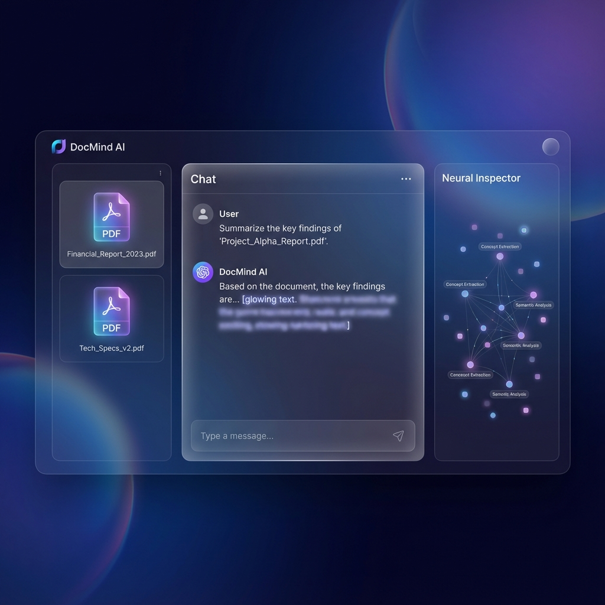
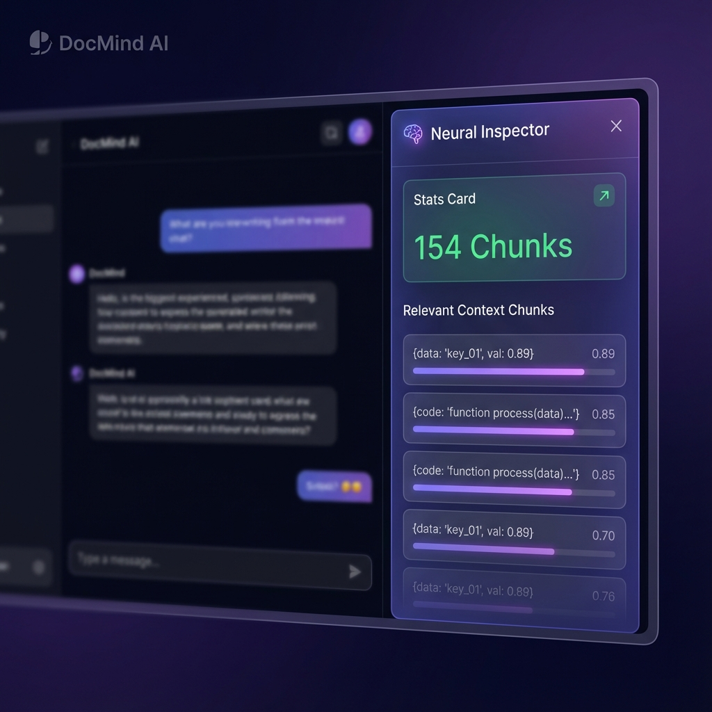
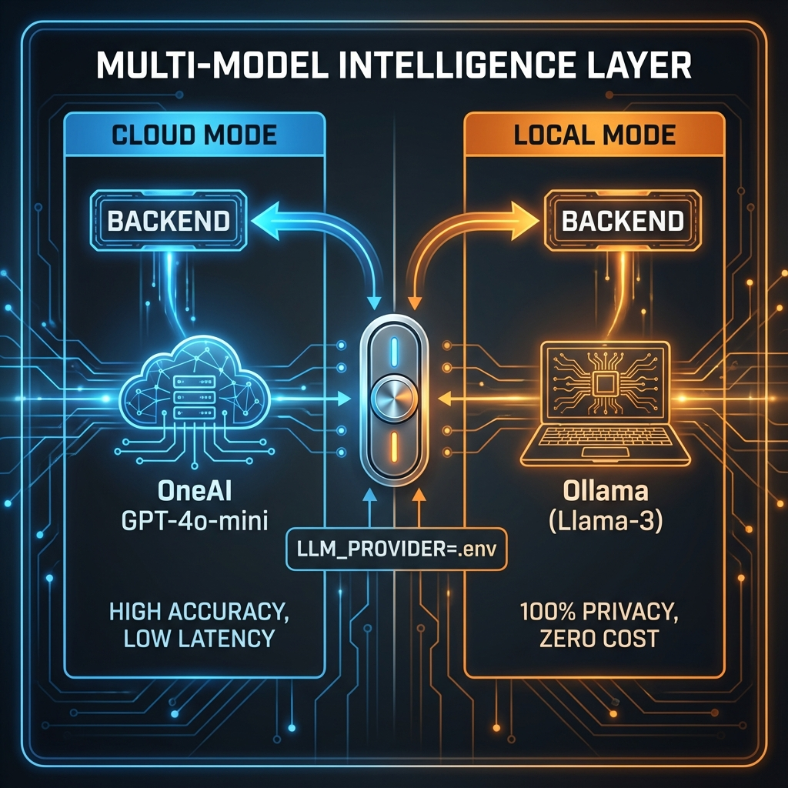

# 🧠 DocMind AI - Enterprise RAG System

> **Privacy-First Document Intelligence** | Hybrid Cloud-Local Architecture | Production-Grade RAG



## 🎯 What is DocMind AI?

DocMind AI is a **production-ready Retrieval Augmented Generation (RAG) system** that lets you chat with your documents while keeping your data completely private. Built for enterprises dealing with sensitive contracts, manuals, and legal documents.

### The Problem We Solve

- **🔒 Data Privacy**: Never upload confidential documents to public AI services
- **🎯 AI Hallucinations**: Get answers grounded in YOUR documents, not generic knowledge
- **📚 Context Limits**: Process 500+ page documents that exceed standard AI token limits
- **💰 Cost Control**: Pay only for what you use with hybrid local-cloud architecture

### The Solution

**Hybrid Architecture**:
- **Local Storage**: Your document embeddings stay on YOUR infrastructure (ChromaDB)
- **Cloud Intelligence**: Only relevant text snippets sent to AI for reasoning
- **Dual Model Support**: Choose between OpenAI GPT-4o mini or local Llama 3

---

## ✨ Key Features

### 🚀 Core Capabilities
- **Multi-Model Support**: Toggle between GPT-4o mini (cloud) and Llama 3 (local/server)
- **Smart Document Processing**: Advanced PDF parsing with intelligent chunking
- **Semantic Search**: Vector-based similarity search using ChromaDB
- **Real-Time Neural Inspector**: Debug and visualize the AI's "knowledge base"
- **Knowledge Base Management**: Clear and reset database with one click

### 🎨 User Experience
- **Premium Dark/Light Themes**: Sleek, modern interface with Framer Motion animations
- **Instant Model Switching**: Auto-clears chat when toggling models to prevent confusion
- **Source Attribution**: See exactly which document sections were used for each answer
- **Live System Metrics**: Real-time CPU and memory monitoring

### 🏢 Enterprise Ready
- **Fully Containerized**: Docker Compose for one-command deployment
- **Scalable Backend**: High-performance FastAPI with async support
- **Production ChromaDB**: Persistent vector storage with connection pooling
- **Environment-Based Config**: Easy deployment across dev/staging/prod

---

## 🛠️ Technology Stack

| Layer             | Technology                   | Purpose                                    |
| ----------------- | ---------------------------- | ------------------------------------------ |
| **Frontend**      | Next.js 16 + TypeScript      | Modern React framework with SSR            |
| **Styling**       | Tailwind CSS + Framer Motion | Responsive UI with smooth animations       |
| **Backend**       | FastAPI (Python 3.11)        | High-performance async REST API            |
| **Vector DB**     | ChromaDB (Docker)            | Local vector embeddings storage            |
| **AI - Cloud**    | OpenAI GPT-4o mini           | Cost-effective reasoning ($0.15/1M tokens) |
| **AI - Local**    | Llama 3 (Ollama)             | Privacy-first local/server inference       |
| **Embeddings**    | text-embedding-3-small       | 768-dimensional semantic vectors           |
| **Orchestration** | LangChain                    | RAG pipeline management                    |

### Architecture Diagram

```
┌─────────────┐      ┌──────────────┐      ┌─────────────┐
│   Browser   │─────▶│  Next.js     │─────▶│  FastAPI    │
│   (User)    │◀─────│  Frontend    │◀─────│  Backend    │
└─────────────┘      └──────────────┘      └──────┬──────┘
                                                   │
                     ┌─────────────────────────────┼─────────────┐
                     │                             │             │
                     ▼                             ▼             ▼
              ┌─────────────┐             ┌─────────────┐  ┌──────────┐
              │  ChromaDB   │             │   OpenAI    │  │  Ollama  │
              │  (Vectors)  │             │ GPT-4o mini │  │  Llama 3 │
              └─────────────┘             └─────────────┘  └──────────┘
                  LOCAL                        CLOUD          LOCAL/SERVER
```

---

## ⚡ Quick Start

### Prerequisites
- **Docker** & **Docker Compose** (for backend and ChromaDB)
- **Node.js 18+** (for frontend)
- **OpenAI API Key** (get from [platform.openai.com](https://platform.openai.com))
- *(Optional)* **Ollama** for local Llama 3 inference

### Installation

1. **Clone the Repository**
   ```bash
   git clone https://github.com/Kimosabey/docmind-ai.git
   cd docmind-ai
   ```

2. **Configure Environment**
   ```bash
   # Copy example and add your API key
   cp .env.example .env
   
   # Edit .env and set:
   OPENAI_API_KEY=sk-your-actual-key-here
   ```

3. **Start Backend Services (Docker)**
   ```bash
   docker-compose up -d --build
   ```
   ✅ Backend API: `http://localhost:8000`  
   ✅ ChromaDB: `http://localhost:8001`

4. **Start Frontend**
   ```bash
   cd frontend
   npm install
   npm run dev
   ```
   ✅ **Access DocMind AI**: `http://localhost:3000`

---

## 🔧 Configuration Options

### Using OpenAI (Default - Recommended)

DocMind AI works out of the box with OpenAI GPT-4o mini. Just set your API key in `.env`:

```ini
OPENAI_API_KEY=sk-your-key-here
LLM_PROVIDER=openai
```

**Cost**: ~$0.15 per million tokens (very affordable for most use cases)

### Using Ollama Llama 3 (Privacy-First)

For complete data privacy or air-gapped environments:

**Option A: Local Ollama**
```bash
# Install Ollama
curl -fsSL https://ollama.com/install.sh | sh

# Pull models
ollama pull llama3
ollama pull mxbai-embed-large

# Update .env
LLM_PROVIDER=ollama
OLLAMA_BASE_URL=http://host.docker.internal:11434
OLLAMA_MODEL=llama3
OLLAMA_EMBED_MODEL=mxbai-embed-large
```

**Option B: Remote Ollama Server**

If you have a powerful GPU server running Ollama:

1. **On the server**, ensure Ollama listens on network:
   ```bash
   OLLAMA_HOST=0.0.0.0:11434 ollama serve
   ```

2. **On your laptop**, update `.env`:
   ```ini
   OLLAMA_BASE_URL=http://<SERVER_IP>:11434
   OLLAMA_MODEL=llama3
   OLLAMA_EMBED_MODEL=mxbai-embed-large
   ```

3. **Restart backend**:
   ```bash
   docker-compose restart backend
   ```

---

## 📖 Usage Guide

### 1. Upload a Document
- Click **"Upload PDF"** button
- Select any PDF (contracts, manuals, research papers)
- Wait for processing (chunking → embedding → storage)
- ✅ See confirmation: "Successfully processed [filename]"

### 2. Ask Questions
- Type your question in the chat input
- AI retrieves relevant sections from YOUR document
- Get accurate, sourced answers (not generic AI knowledge)
- See source citations showing which pages were used

### 3. Switch Models (Optional)
- Toggle between **"GPT-4o mini"** and **"Llama 3"** in top-right
- Chat automatically clears to prevent confusion
- All subsequent questions use the selected model

### 4. Neural Inspector (Advanced)
- Click **Database icon** in header
- View real-time system metrics (CPU, Memory)
- See vector count and dimensions
- Monitor active documents
- **Clear Knowledge Base** to reset everything

---

## 🎨 Screenshots

### Main Chat Interface


### Neural Inspector


### Model Architecture


---

## 🔍 How It Works (Technical Deep Dive)

### RAG Pipeline Flow

1. **Document Ingestion**
   ```python
   PDF → Text Extraction → Chunking (1000 chars, 200 overlap)
   ```

2. **Embedding Generation**
   ```python
   Text Chunks → OpenAI Embeddings → 768D Vectors
   ```

3. **Vector Storage**
   ```python
   Vectors + Metadata → ChromaDB (Persistent Storage)
   ```

4. **Query Processing**
   ```python
   User Question → Embedding → Similarity Search (Top 3 chunks)
   ```

5. **Answer Generation**
   ```python
   Context (Top 3 chunks) + Question → LLM → Grounded Answer
   ```

### Key Design Decisions

- **Chunk Size**: 1000 characters with 200 overlap for context preservation
- **Top-K**: Retrieve 3 most relevant chunks (balance between context and token cost)
- **Embedding Model**: text-embedding-3-small (cheap, fast, accurate)
- **LLM**: GPT-4o mini (80% cheaper than GPT-4, sufficient for RAG)

---

## 🚢 Deployment

### Docker Production

```bash
# Build and start all services
docker-compose up -d --build

# View logs
docker-compose logs -f

# Stop services
docker-compose down

# Rebuild specific service
docker-compose up -d --build backend
```

### Environment Variables Reference

```ini
# Required
OPENAI_API_KEY=sk-xxx

# Optional - Ollama
LLM_PROVIDER=openai|ollama
OLLAMA_BASE_URL=http://localhost:11434
OLLAMA_MODEL=llama3
OLLAMA_EMBED_MODEL=mxbai-embed-large

# Optional - ChromaDB
CHROMA_HOST=chromadb
CHROMA_PORT=8000
```

---

## 🐛 Troubleshooting

### Common Issues

**Backend won't start**
```bash
# Check Docker logs
docker logs docmind-api

# Common fix: rebuild
docker-compose up -d --build backend
```

**Frontend shows "Network Error"**
- Ensure backend is running: `curl http://localhost:8000/health`
- Check `.env` has valid `OPENAI_API_KEY`
- Verify Docker containers: `docker ps`

**Ollama connection refused**
- Server: Ensure `OLLAMA_HOST=0.0.0.0:11434 ollama serve`
- Client: Check firewall allows port 11434
- Test: `curl http://<SERVER_IP>:11434/api/tags`

**Hydration errors (React)**
- Hard refresh browser: `Ctrl+Shift+R`
- Clear Next.js cache: `rm -rf frontend/.next`

---

## 🗺️ Roadmap

### ✅ Completed
- [x] Core RAG pipeline with OpenAI
- [x] ChromaDB vector storage
- [x] Next.js premium UI with dark mode
- [x] Ollama/Llama 3 integration
- [x] Neural Inspector dashboard
- [x] Knowledge base reset functionality
- [x] Auto-clear chat on model switch

### 🚧 In Progress
- [ ] Multi-file upload support
- [ ] Advanced chunking strategies
- [ ] Re-ranking for better retrieval

### 🔮 Planned
- [ ] Multi-document Q&A (cross-reference)
- [ ] Export chat history
- [ ] Custom prompt templates
- [ ] Agentic workflows (SQL integration)
- [ ] Vision support (OCR for scanned PDFs)

---

## 🤝 Contributing

Contributions are welcome! Please:

1. Fork the repository
2. Create a feature branch (`git checkout -b feature/amazing-feature`)
3. Commit changes (`git commit -m 'Add amazing feature'`)
4. Push to branch (`git push origin feature/amazing-feature`)
5. Open a Pull Request

---

## 📄 License

This project is licensed under the MIT License - see [LICENSE](LICENSE) file for details.

---

## 👨‍💻 Author

**Harshan Aiyappa**  
*Software Engineer & AI Architect*

- GitHub: [@Kimosabey](https://github.com/Kimosabey)
- LinkedIn: [Harshan Aiyappa](https://linkedin.com/in/harshan-aiyappa)

---

## ⭐ Star History

If you find this project useful, please consider giving it a star ⭐

---

**Built with ❤️ for the Enterprise AI Community**
