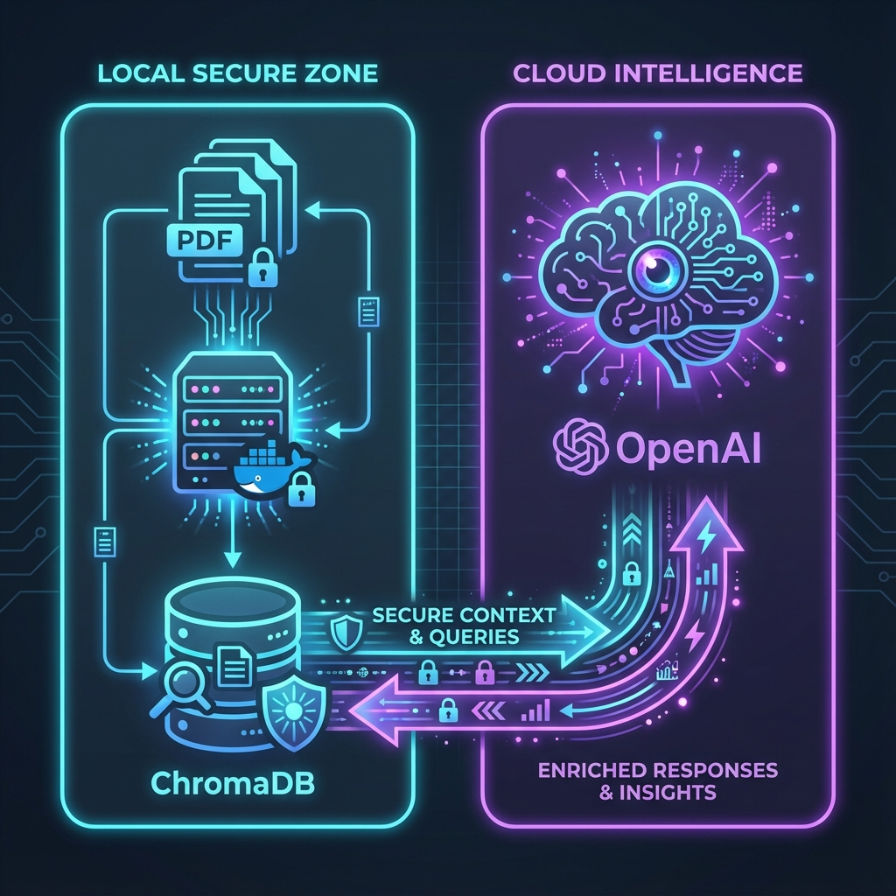
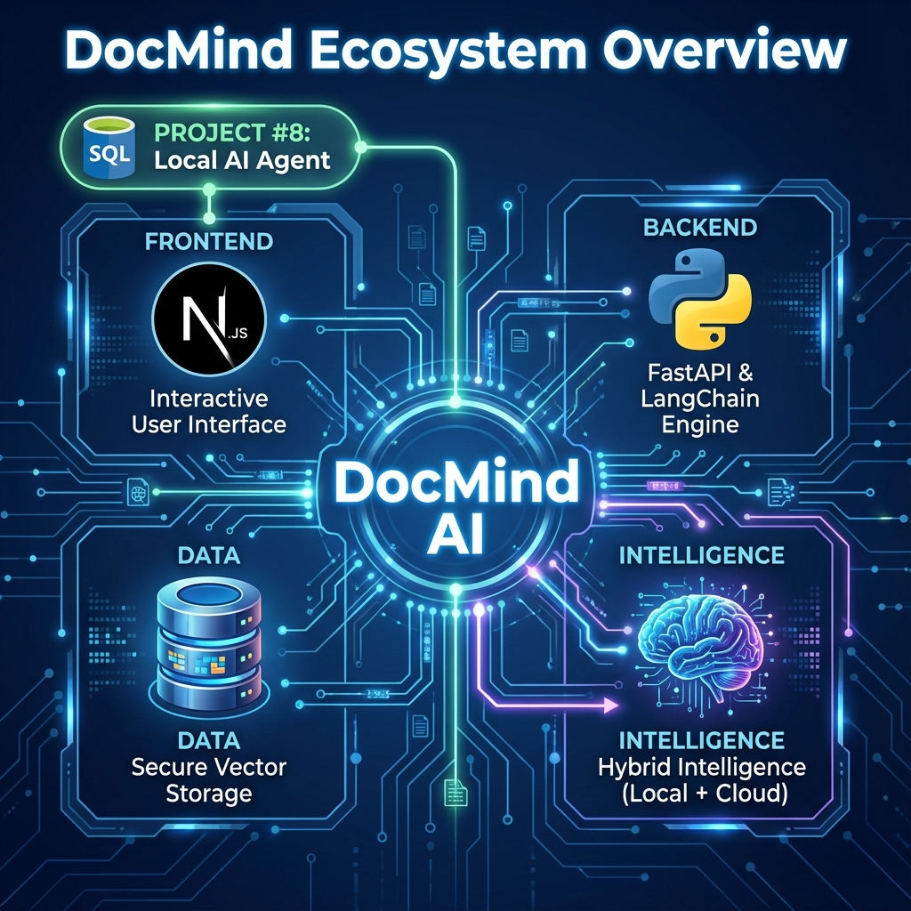

# 🧠 DocMind AI (Hybrid RAG Engine)
> *Formerly distinct projects "SpecLens" and "SilenceShield", now unified into the DocMind Enterprise Intelligence Platform.*



## 🌌 The Ecosystem Infographic
> *A high-level view of how all components fit together.*



## 🚀 Project Overview
**DocMind AI** is a privacy-first **Retrieval Augmented Generation (RAG)** system designed for enterprise environments. It solves the critical problem of "Hallucinations" and "Data Privacy" by keeping your documents stored locally while using advanced cloud AI only for reasoning.

### The Core Problem
1. **Hallucinations**: Public LLMs guess when they don't know your specific business rules.
2. **Privacy**: You cannot upload sensitive legal contracts to public ChatGPT sessions.
3. **Context Limits**: Large manuals (500+ pages) break standard token limits.

### The Solution: Hybrid Architecture
We utilize a **Hybrid RAG** approach:
- **Storage (Local)**: Vector embeddings of your documents reside in your own Docker container (ChromaDB).
- **Compute (Cloud)**: We send *only* the relevant snippets to OpenAI (`gpt-4o-mini`) to generate the final answer.

---

## 🛠️ System Architecture

### Tech Stack
| Component        | Technology                | Role                                                      |
| :--------------- | :------------------------ | :-------------------------------------------------------- |
| **Frontend**     | `Next.js 14` + `Tailwind` | Modern, responsive Chat UI with Framer Motion animations. |
| **Backend**      | `FastAPI` (Python)        | High-performance async API managing ingestion and chat.   |
| **Vector DB**    | `ChromaDB` (Docker)       | Local storage for document embeddings (Privacy Layer).    |
| **AI Model**     | `GPT-4o-mini`             | Cost-effective reasoning engine ($0.15 / 1M tokens).      |
| **Orchestrator** | `LangChain`               | Logic glue for chunking, embedding, and prompting.        |

### Data Flow
1. **Ingest**: User uploads a valid PDF.
2. **Chunk**: Backend splits text into 1000-char overlapping segments.
3. **Embed**: Text is converted to math vectors (`text-embedding-3-small`).
4. **Store**: Vectors are saved locally in ChromaDB.
5. **Retrieve**: User asks a question → System finds top 3 matching chunks.
6. **Answer**: LLM generates a response based *only* on those chunks.

---

## ⚡ Quick Start

### Prerequisites
- Docker & Docker Compose
- Node.js 18+
- Python 3.10+
- OpenAI API Key

### Installation

1. **Clone & Config**
   ```bash
   git clone https://github.com/your-repo/docmind-ai.git
   cd docmind-ai
   # Create .env file
   echo "OPENAI_API_KEY=sk-your-key" > .env
   ```

2. **Start Infrastructure (Docker)**
   ```bash
   docker-compose up -d --build
   ```
   *This starts ChromaDB (Port 8001) and the Backend API (Port 8000).*

3. **Start Frontend**
   ```bash
   cd frontend
   npm install
   npm run dev
   ```
   *Access the UI at* `http://localhost:3000`

---

## 🔍 Neural Inspector (New!)
We have included a built-in debugging tool to visualize the "Brain" of the AI. 
- Click the **Database Icon** in the top-right header.
- View real-time statistics on stored vectors.
- Inspect the raw text chunks that the AI is using to answer your questions.

---

## 🔮 Roadmap (Phase 2 & 3)
- [x] **Phase 1**: Hybrid RAG Core (Completed)
- [ ] **Phase 2**: Local Agentic Workflows (Reasoning on SQL)
- [ ] **Phase 3**: Multi-Model Support (Ollama/Llama-3 Integration)

---
*Built with ❤️ for the Advanced Agentic Coding Project.*
