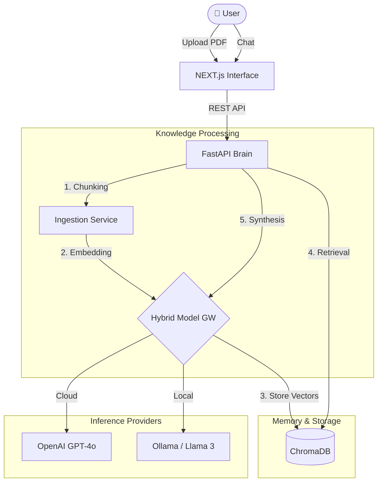

# 🏗️ System Architecture

## 1. High-Level Design (HLD)

DocMind AI implements a **Hybrid RAG Architecture** (Retrieval-Augmented Generation). It allows seamless switching between Cloud (OpenAI) and Local (Ollama/Llama 3) inference engines, all backed by a persistent Vector Store (ChromaDB).

### Core Components
1.  **Next.js Frontend**: A React 18 application with "Neural Inspector" for visualization.
2.  **FastAPI Backend**: Asynchronous Python service handling document parsing, chunking, and LLM orchestration.
3.  **ChromaDB**: Local vector database running in Docker, providing persistence for embeddings.
4.  **Hybrid Model Gateway**: A unified interface that routes requests to either OpenAI (Cloud) or Ollama (Local) based on user preference.

---

## 2. Low-Level Design (LLD)

### The RAG Pipeline
Retrieval Augmented Generation is broken into two distinct flows:

**A. Ingestion (The "Learning" Phase)**
1.  **Parse**: Extract text from PDF using `pypdf`.
2.  **Chunk**: Split text into 1000-character overlapping segments.
3.  **Embed**: Convert text to vectors (e.g., 1536-dim for OpenAI, 1024-dim for Ollama).
4.  **Index**: Store vector + metadata + original text in ChromaDB.

**B. Retrieval (The "Thinking" Phase)**
1.  **Query**: User asks "What is the holiday policy?".
2.  **Embed Query**: Convert question to vector.
3.  **Similarity Search**: Find top 3 document chunks using Cosine Similarity.
4.  **Synthesize**: Feed chunks + question to the LLM to generate a grounded answer.

### Vector Schema (ChromaDB)
*   `id`: UUID
*   `embedding`: `List[float]` (The vector)
*   `document`: String (Original text chunk)
*   `metadata`: `{ "source": "employee_handbook.pdf", "page": 12 }`

---

## 3. Decision Log

| Decision | Alternative | Reason for Choice |
| :--- | :--- | :--- |
| **FastAPI** | Next.js API Routes | **Ecosystem**. Python is the native language of AI. Libraries like `LangChain`, `Chromadb-client`, and `pypdf` are far more mature in Python than JS. |
| **ChromaDB** | Pinecone / pgvector | **Simplicity & Privacy**. ChromaDB runs locally as a Docker container (perfect for portfolio). Pinecone is cloud-only; pgvector requires complex Postgres setup. |
| **Hybrid Architecture** | Cloud Only | **Cost & Privacy**. Allowing local Llama 3 execution demonstrates "Privacy-First" engineering and reduces API costs for large document sets. |

---

## 4. Key Patterns

### The "Neural Inspector"
A visual observability pattern. Instead of the Vector DB being a black box, the Frontend visualizes the storage state (document counts, embedding dimensions) in real-time, making the system transparent.

### Model Agnostic Interface
The backend implements the **Strategy Pattern** for LLMs. The rest of the system deals with a generic `LLMProvider` interface, allowing us to swap GPT-4 for Llama 3 or Claude without rewriting business logic.
