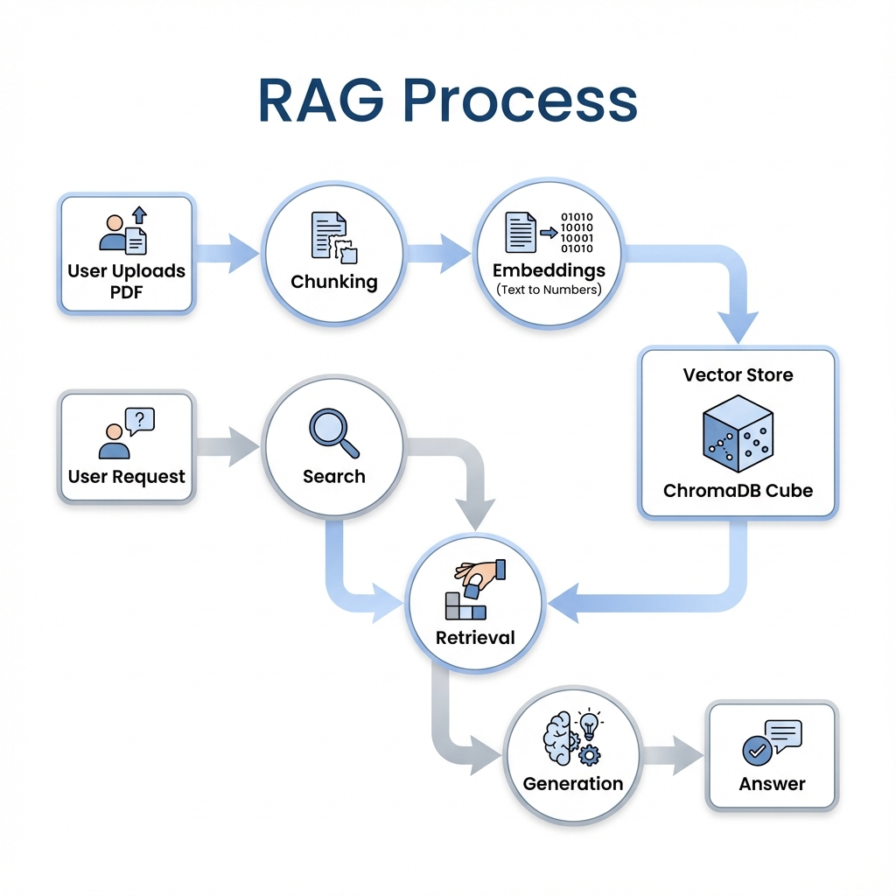

# 🏗️ DocMind AI - System Architecture

Welcome to the technical deep-dive of **DocMind AI**. This document explains exactly how the system works, from the user interface down to the vector mathematics.

---

## 🌌 High-Level Architecture

The system is composed of **5 main components** working in harmony.


### **1. Frontend (Next.js)**
- **Port:** `3000`
- **Role:** User Interface.
- **Tech:** React, Tailwind CSS, Framer Motion.
- **Function:** Handles PDF uploads, chat interface, and visualizations. Contains the **Model Toggle** (GPT-4 vs Llama 3).

### **2. Backend (FastAPI)**
- **Port:** `8000`
- **Role:** The Brain / Orchestrator.
- **Tech:** Python, FastAPI, LangChain.
- **Function:** 
  - Receives PDFs and chunks them.
  - Dynamically routes requests to Cloud or Local AI.
  - Stores vectors in ChromaDB.

### **3. ChromaDB (Vector Store)**
- **Port:** `8001`
- **Role:** Long-term Memory.
- **Tech:** ChromaDB (running in Docker).
- **Function:** Stores the "semantic meaning" of your documents.

### **4. Intelligence Layer (Hybrid)**
- **Role:** Dual-Engine Cognitive System.
- **Option A: OpenAI (Cloud)**
  - Model: `gpt-4o-mini`
  - Use Case: High accuracy, complex reasoning.
- **Option B: Ollama (Local)**
  - Model: `llama3.2` (via Docker/Host).
  - Use Case: Privacy-first, offline capable, zero cost.
- **Switching:** Users can toggle between these engines instantly via the UI.

### **5. Local AI Agent (Independent Worker)**
- **Role:** Specialist Task Executor.
- **Tech:** Python Script.
- **Function:** A standalone demo showcasing "Agentic AI". It can inspect SQL databases and reason about data autonomously.

---

## 🧠 The "Brain" Logic: How RAG Works

RAG (**R**etrieval **A**ugmented **G**eneration) is the core algorithm powering DocMind.



### **Phase 1: Ingestion (Learning)**
1. **Upload:** You upload a PDF (e.g., "Holiday List.pdf").
2. **Chunking:** The backend splits it into small pieces (e.g., 1000 characters each).
3. **Embedding:** It sends each piece to OpenAI. OpenAI replies with a list of 1536 numbers (a vector) representing the *meaning* of that text.
4. **Storage:** We save the text + the numbers in **ChromaDB**.

### **Phase 2: Retrieval (Thinking)**
1. **Question:** You ask "What are the holidays?"
2. **Vectorization:** We convert your question into 1536 numbers using the same OpenAI model.
3. **Similarity Search:** ChromaDB compares your question's numbers against all stored document numbers to find the closest matches (Cosine Similarity).
4. **Context Assembly:** We grab the top 3 matching text chunks.

### **Phase 3: Generation (Answering)**
1. **Prompt Construction:** We send a prompt to GPT-4:
   > "Here is some context from a document: [Context Chunks]
   > User Question: [Your Question]
   > Answer the question using ONLY the context provided."
2. **Response:** GPT-4 writes the answer.
3. **Display:** The frontend shows you the answer.

---

## 🛠️ Folder Structure Map

```bash
docmind-ai/
├── frontend/               # Next.js UI Application
│   ├── app/                # Pages & Routes
│   └── components/         # React Components (Chat, Inspector)
│
├── backend/                # FastAPI Application
│   ├── main.py             # API Entry point
│   └── services/           # Business Logic
│       ├── ingestion.py    # PDF Processing logic
│       └── vector_store.py # ChromaDB interaction logic
│
├── chromadb-admin/         # The Admin Dashboard UI
│   └── src/                # Admin Panel Code
│
├── local-ai-agent/         # Standalone SQL Agent Demo
│   ├── src/agent.py        # The Thinking Agent
│   └── data/sales.db       # Demo SQLite Database
│
└── docker-compose.yml      # Orchestration Config
```

---

## 🧪 Testing The System

You have 3 ways to interact with the brain:

| Interface    | URL                          | Use Case                         |
| ------------ | ---------------------------- | -------------------------------- |
| **Main App** | `http://localhost:3000`      | Chatting with documents          |
| **Admin UI** | `http://localhost:3001`      | Inspecting the database visually |
| **API Docs** | `http://localhost:8000/docs` | Debugging backend endpoints      |

---


---

## 👨‍💻 Architecture Design By

**Harshan Aiyappa**  
*Software Engineer & Architect*
