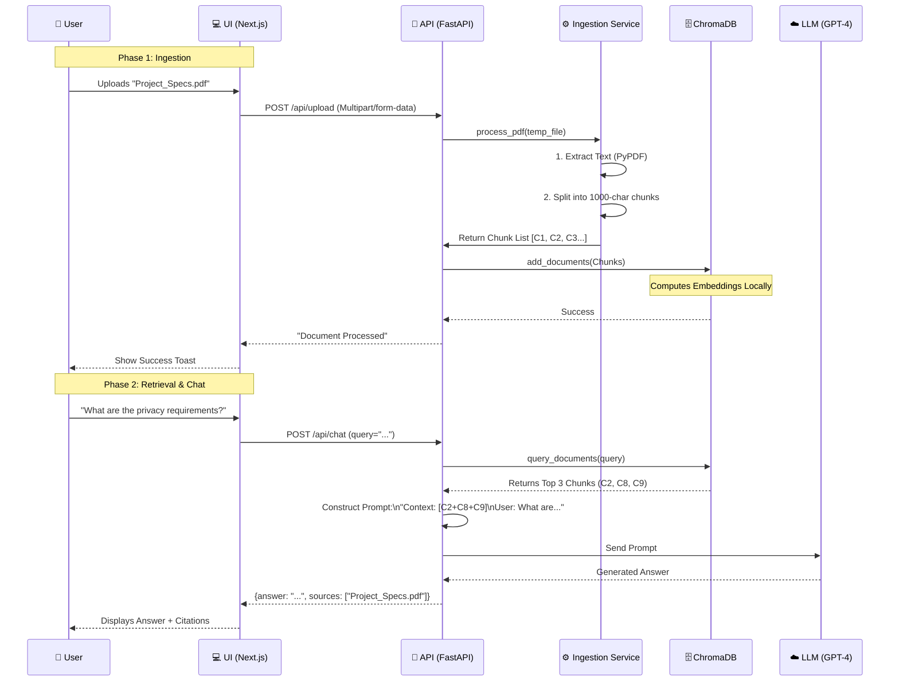

# 🌊 System Flow & Lifecycle

This document traces the complete lifecycle of data within DocMind AI, from the moment a user uploads a PDF to the moment they receive an answer.

## detailed Data Stages

1.  **Raw Input**: PDF Binary.
2.  **Text Extraction**: Plain string in memory.
3.  **Chunking**: List of strings with overlapping windows (to preserve context).
4.  **Vectorization**: 384-dimensional float arrays (using `all-MiniLM-L6-v2`).
5.  **Peristence**: Stored in `ChromaDB` (parquet files on disk).
6.  **Retrieval**: Identify chunks with smallest Cosine Distance to the query vector.
7.  **Synthesis**: LLM "reads" the retrieved text and formulates a human response.
