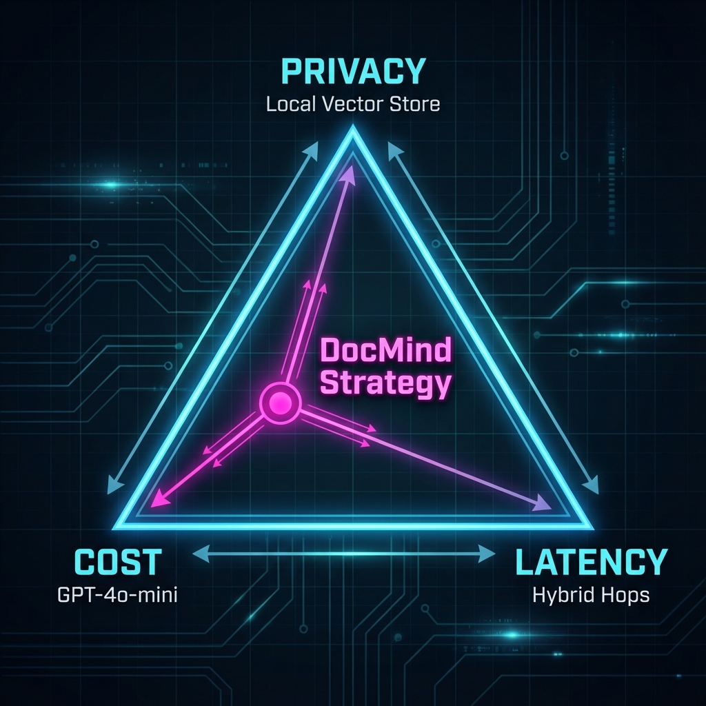

# 🎓 Engineer's Interview Guide: DocMind AI
> *A cheat sheet for explaining this project in Senior/Principal Engineer interviews.*

## 📌 Core Architectural Decisions

### Q1: Why did you choose a "Hybrid" RAG approach instead of fully local or fully cloud?
**The "Senior" Answer:**
"I designed it to balance **Privacy**, **Cost**, and **User Experience**. 

- **Privacy:** Enterprise documents shouldn't just be dumped into a public cloud API blindly. By running **ChromaDB locally** (via Docker), I ensure the raw knowledge base stays within our VPC/Infrastructure.
- **UX:** Fully local models (like Llama-3 on CPU) result in 15-30s latency, which is unacceptable for a chat interface.
- **Solution:** We only send *ephemeral, anonymized chunks* to OpenAI for the final reasoning step. This creates a sweet spot: Data sovereignty of a local system + Speed of a cloud model."

### Q2: How do you handle "Hallucinations"?
**The "Senior" Answer:**
"I implemented a strict **Retrieval-Augmented Generation (RAG)** pipeline.
1.  **Grounding:** The system Prompt explicitly instructs the LLM: *'Answer ONLY using the provided context.'*
2.  **Telemetry:** The 'Neural Inspector' feature allows engineers to inspect exactly which text chunks were retrieved. If the DB returns garbage, we know it's a retrieval issue, not a model reliability issue.
3.  **Temperature 0:** I force the model to be deterministic."

---

## 🔧 Technical Deep Dives

### Q3: Why ChromaDB over PostgreSQL (pgvector)?
"For this microservice, I needed a purpose-built **Vector-Native** solution. ChromaDB offers:
- **Zero-Setup:** It runs purely in-memory or persisted via file (SQLite based) without managing a heavy Postgres cluster.
- **Metadata Filtering:** It handles complex metadata queries natively, which is crucial when filtering chunks by 'Page Number' or 'Document Source' in the future."

### Q4: How does the Chunking Strategy affect retrieval?
"I used **Recursive Character Splitting** (1000 chars with 200 overlap). 
- **Why Overlap?** If a sentence like *'The fine is $500'* is cut between two chunks, the meaning is lost. Overlap ensures semantic continuity.
- **Why 1000?** It's roughly one paragraph. Small enough to be specific, large enough to carry context for the embedding model (`text-embedding-3-small`)."

---

## 🚀 Scenario Based Questions

### Q5: "The system is slow. How do you scale it?"
1.  **Read Replicas:** Scale the Vector DB (Chroma/Pinecone) to handle concurrent reads.
2.  **Async Ingestion:** PDF processing is CPU intensive. I would move the `/upload` endpoint to a **Queue (Celery/BullMQ)** so the user doesn't wait for the HTTP connection to hang while we generate embeddings.
3.  **Cache:** Implement **Redis Semantic Cache**. If a user asks "What is the refund policy?" twice, we serve the cached answer instantly without hitting OpenAI."

### Q6: "We need to secure this for Multi-Tenant use (SaaS). What changes?"
"Currently, it's Single Tenant. For SaaS:
1.  **Namespace Isolation:** In ChromaDB, I would tag every vector with `organization_id`.
2.  **Filter Enforcement:** Every query MUST include `.where(organization_id == user.org_id)` to prevent data leaks between companies.
3.  **Routable API Keys:** Allow customers to bring their own OpenAI Keys to manage costs."

---

*Study this before your system design interview. It demonstrates you think about Trade-offs, not just Code.*
