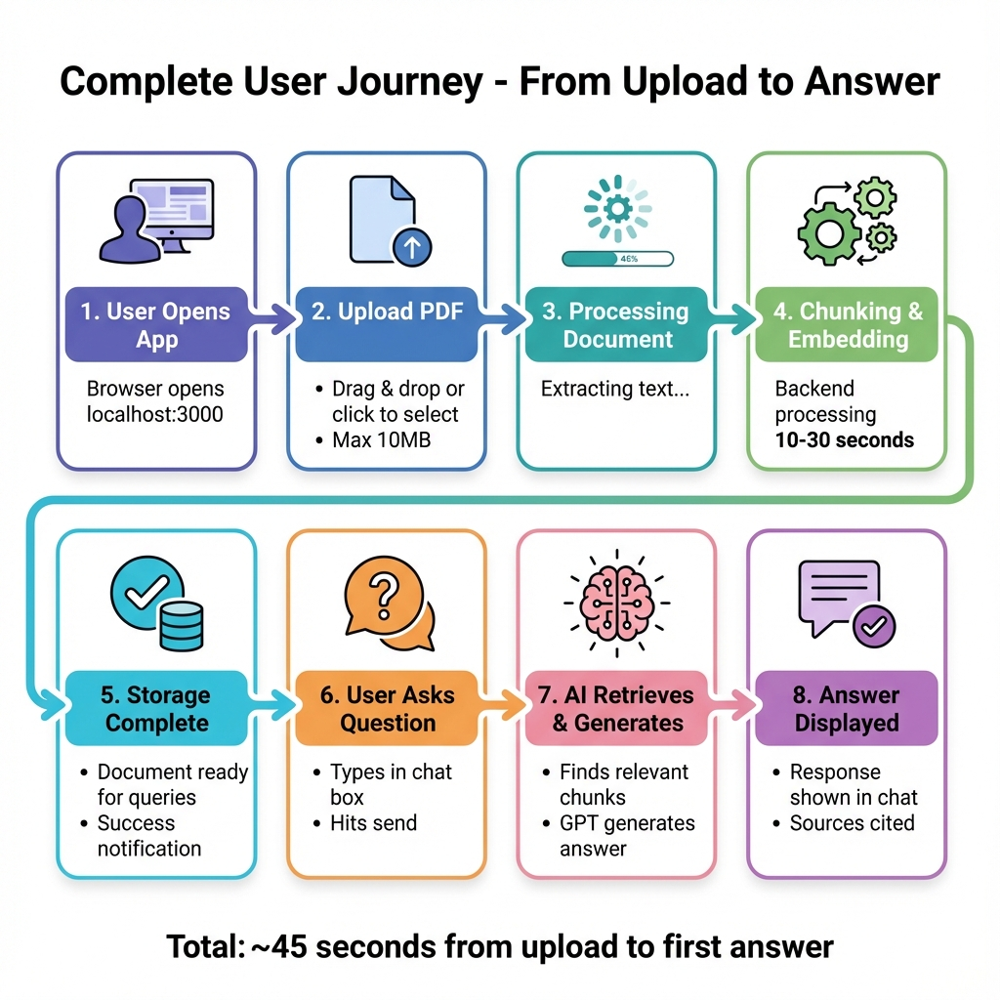
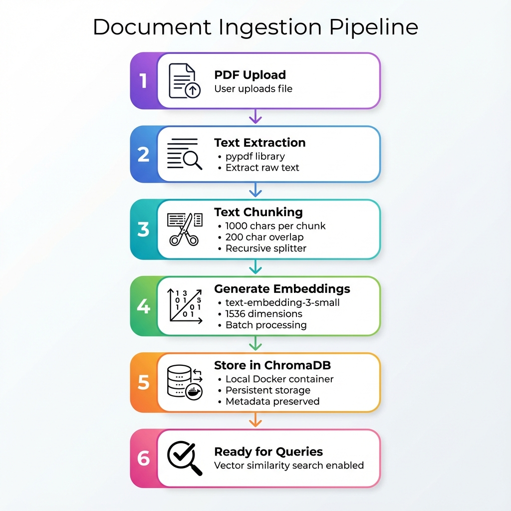

# 🔄 System Flow & User Journey

> *Visualizing the request lifecycle from User Action to System Response.*

## 1. The Interaction Sequence
This diagram details the exact "Handshake" between the User, our Frontend, the Local Vector Brain, and the Cloud Intelligence.

## 2. The Data Pipeline (Ingestion)
How a raw PDF becomes "Liquid Intelligence".

---

## 3. Step-by-Step Flow Description

### Phase A: Knowledge Acquisition
1.  **User Uploads**: A PDF (e.g., "Employee_Handbook.pdf") is dropped into the Next.js UI.
2.  **Secure Handoff**: The file is streamed to the FastAPI backend.
3.  **The "Meat Grinder"**:
    -   File is read into memory.
    -   `RecursiveCharacterTextSplitter` chops it into 1000-character overlapping segments.
4.  **Vectorization**: Each segment is sent to `text-embedding-3-small` to get a 1536-dimensional float array.
5.  **Persistence**: The vector + metadata (page number, source) is saved to **ChromaDB** (Volume: `/chroma_data`).

### Phase B: The Query Loop
1.  **User Asks**: "Does the company pay for gym memberships?"
2.  **Search**:
    -   Backend converts question -> Vector.
    -   ChromaDB performs "Cosine Similarity Search".
    -   *Result*: Finds Paragraph 4 on Page 12 ("Wellness Benefits").
3.  **Synthesis**:
    -   **Context**: "Company reimburses up to $50/mo for gym..."
    -   **Prompt**: "Context: [Above]. Question: Does company pay for gym?"
    -   **LLM**: "Yes, the company reimburses up to $50/month."
4.  **Delivery**: The answer is streamed back to the UI.
