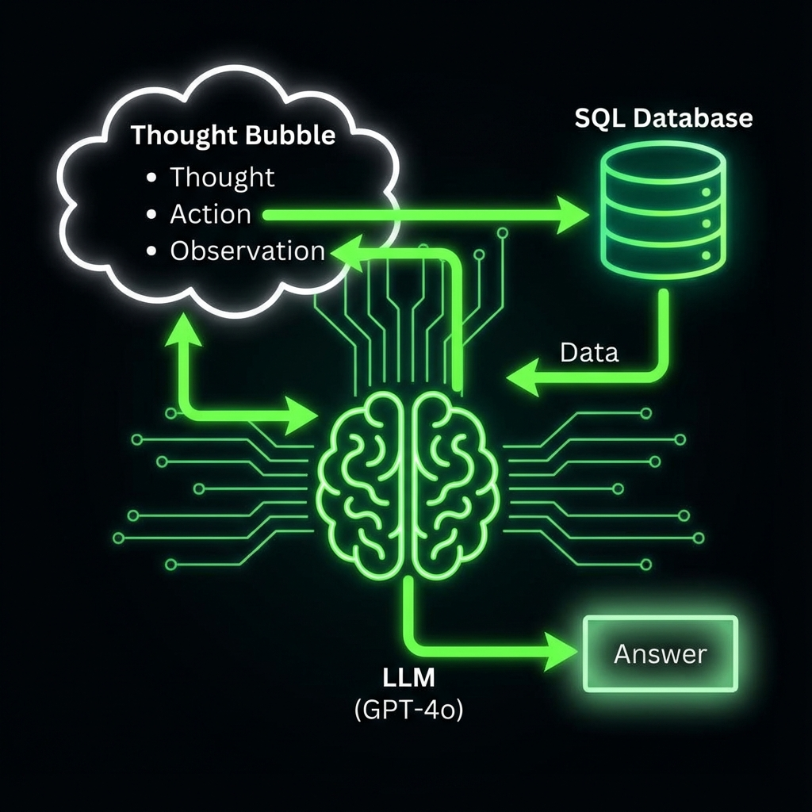

# 🧠 Local AI Agent (SQL Reasoning)
> *Part of the "Agentic Layer" (Phase 3).*



## 📌 What is this?
This is an implementations of the **ReAct (Reason + Act)** pattern.
Instead of just answering from pre-trained knowledge, this Agent:
1.  **Analyzes** the user's question.
2.  **Inspects** the database schema to understand available data.
3.  **Writes** a raw SQL query.
4.  **Executes** the query.
5.  **Synthesizes** the result into natural language.

## 🛠️ Tech Stack
-   **LangChain**: Orchestration.
-   **OpenAI GPT-4o-mini**: The "Brain" that writes SQL.
-   **SQLite**: The "Tool" the agent uses.

## 🚀 How to Run
1.  **Setup Environment**
    ```bash
    python -m venv venv
    .\venv\Scripts\activate
    pip install -r requirements.txt
    ```

2.  **Seed the Database**
    Creates a dummy `sales.db` with Users and Orders.
    ```bash
    python scripts/seed_db.py
    ```

3.  **Run the Agent**
    ```bash
    python src/agent.py
    ```

## 📝 Example Output
```text
Question: "Who spent the most money?"
thought: I should query the orders table, sum amount by user_id...
Action: sql_db_query("SELECT user_id, sum(amount) as total FROM orders...")
Observation: [(1, 570.50), (2, 60.00)...]
Answer: User 1 spent the most with a total of $570.50.
```
