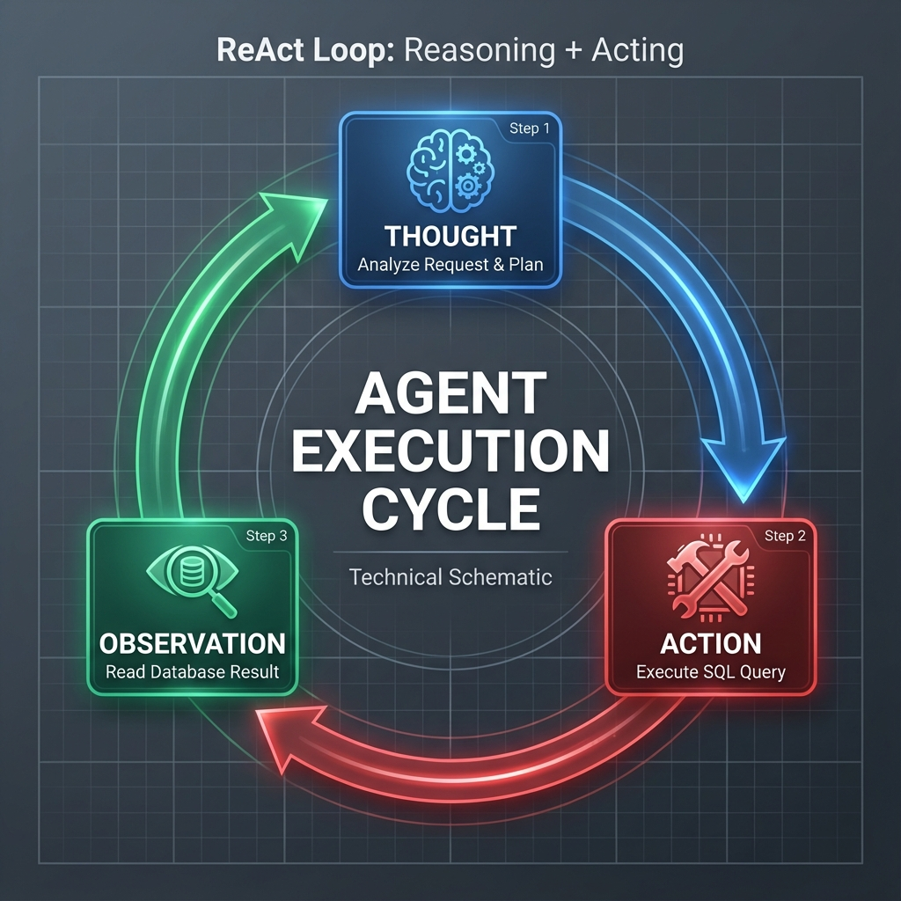

# 🔄 The Agentic Workflow (ReAct Pattern)

> *How the "Brain" thinks before it acts.*

## 1. The Core Loop
The agent does not just "guess" the answer. It enters a **While Loop** of reasoning until it is satisfied.

### Step 1: 🔵 Thought (The Plan)
*   **Trigger**: User asks "Who spent the most money?"
*   **Internal Monologue**: "I need to find a user with the highest sum of 'amount' in the 'orders' table."
*   **Decision**: "I will use the `sql_db_query` tool."

### Step 2: 🔴 Action (The Tool)
*   **Tool**: `sql_db_query`
*   **Input**: `SELECT user_id, SUM(amount) FROM orders GROUP BY user_id ORDER BY SUM(amount) DESC LIMIT 1;`
*   **Execution**: The Python runtime connects to SQLite and runs the query.

### Step 3: 🟢 Observation (The Reality)
*   **Result**: `[(1, 570.50)]`
*   **Feedback**: The agent reads this raw tuple. It now knows User ID 1 is the answer.

### Step 4: Final Synthesis
*   **Thought**: "I have the ID, but I should probably get the name to be helpful. I will query the `users` table for ID 1."
*   **Action**: `SELECT name FROM users WHERE id = 1;`
*   **Observation**: `[('Alice Smith')]`
*   **Final Answer**: "Alice Smith spent the most ($570.50)."

---

## 🆚 Standard LLM vs Agent

| Standard LLM (ChatGPT)                    | Agentic LLM (DocMind Agent)                |
| :---------------------------------------- | :----------------------------------------- |
| **Passively** answers from training data. | **Actively** queries live data.            |
| **Hallucinates** if data is missing.      | **Admits** "I cannot find that in the DB". |
| **Static** knowledge (cutoff date).       | **Dynamic** knowledge (Real-time).         |

---

## 🎨 Color Legend
-   **🔵 Blue**: Reasoning / Planning (Internal)
-   **🔴 Red**: Dangerous / Side-Effect (External Tool Execution)
-   **🟢 Green**: Safe / Validation (Reading Output)
